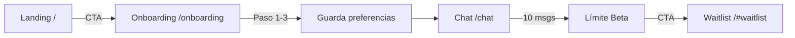

# OverMyShoulder — Arquitectura del Frontend

> Aplicación Next.js 16 con App Router, React 19 y TypeScript.

---

## Estructura General

```
src/
├── app/                  # Rutas (App Router)
│   ├── page.tsx          # Landing (/)
│   ├── onboarding/       # /onboarding
│   └── chat/             # /chat
├── components/           # Componentes UI
│   ├── landing (10)      # Secciones del landing
│   ├── onboarding (4)    # Wizard de 3 pasos
│   └── chat (4)          # Vista del chat
└── api/                  # Cliente HTTP
    ├── client.ts         # apiFetch + ApiError
    ├── chat.ts           # POST /api/chat
    └── waitlist.ts       # POST /api/waitlist
```

---

## A) Landing (`/`)

| Componente | Propósito |
|------------|-----------|
| `Header` | Navegación sticky con logo y enlaces ancla |
| `HeroSection` | CTA principal → `/onboarding` |
| `ProblemSection` | Identificación con el usuario |
| `AboutSection` | Qué es OMS |
| `PrivacySection` | Política de privacidad |
| `HowItWorksSection` | Pasos del flujo |
| `ChatModesSection` | Modos de conversación |
| `DisclaimerSection` | Aviso legal |
| `FinalCTASection` | Waitlist form (id `#waitlist`) |
| `Footer` | Enlaces y créditos |

---

## B) Onboarding (`/onboarding`)

Wizard de 3 pasos con indicador de progreso:

| Paso | Componente | Key |
|------|-----------|-----|
| 1 | `StepPrivacy` | Aviso de privacidad |
| 2 | `StepLimits` | Limitaciones del chatbot |
| 3 | `StepPersonalize` | Selección de `emotionalState` y `tone` |

**Al finalizar:**
- Guarda preferencias en `localStorage` → `oms_user_preferences`
- Redirige a `/chat`

---

## C) Chat (`/chat`)

### Componentes
| Archivo | Rol |
|---------|-----|
| `ChatView.tsx` | Lógica principal del chat |
| `ChatMessage.tsx` | Burbuja de mensaje |
| `ChatInput.tsx` | Campo de entrada |
| `TypingIndicator.tsx` | Indicador "escribiendo..." |

### Estado en `localStorage`
| Clave | Contenido |
|-------|-----------|
| `oms_chat_history` | Array de mensajes (sin errores) |
| `oms_count_msg` | Contador de mensajes del usuario |
| `oms_user_preferences` | `{ emotionalState, tone }` |

### Beta Mode
- Límite: **10 mensajes** por sesión (`MAX_USER_MESSAGES`)
- Contador visible en header
- Al alcanzar límite: input deshabilitado + CTA a waitlist

---

## APIs

Base URL configurada en `.env`:
```bash
# .env.local (desarrollo)
NEXT_PUBLIC_API_BASE_URL=http://localhost:8000

# .env.production
NEXT_PUBLIC_API_BASE_URL=https://pythonbackend-production-d3ea.up.railway.app
```

### Endpoints Utilizados

| Endpoint | Método | Payload | Respuesta |
|----------|--------|---------|-----------|
| `/api/chat` | POST | `{ message, history, setting, use_local }` | `{ response }` |
| `/api/waitlist` | POST | `{ email }` | `{ ok: boolean }` |

### Cliente HTTP (`src/api/client.ts`)
- `apiFetch<T>()` — wrapper genérico con manejo de errores
- Lanza `ApiError` si `!res.ok`

---

## Despliegue

| Entorno | Plataforma | URL |
|---------|------------|-----|
| **Frontend** | Vercel | *(configurado en `.vercel/`)* |
| **Backend** | Railway | `https://pythonbackend-production-d3ea.up.railway.app` |

### Scripts npm
```bash
npm run dev       # Desarrollo local (port 3000)
npm run build     # Build producción
npm run start     # Sirve build
npm run lint      # ESLint
```

---

## Flujo de Usuario


